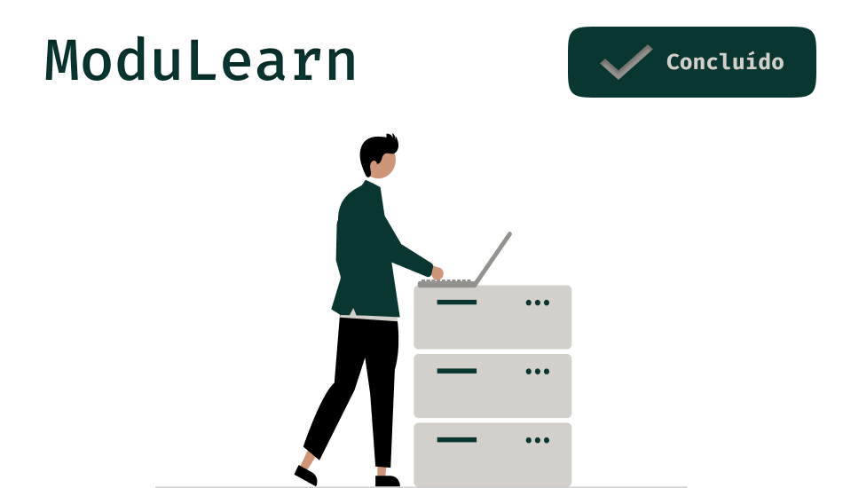

# ModuLearn

ModuLearn é uma plataforma de gestão educacional flexível e altamente escalável, projetada para atender às necessidades de instituições de ensino de todos os tamanhos. Com um sistema back end robusto e intuitivo, o ModuLearn permite a administração eficiente de cursos, usuários e permissões em diferentes níveis de acesso: Administrador, Professor e Aluno.

# Recursos Principais:
* Gerenciamento de Cursos: Os administradores podem criar, editar e excluir cursos, atribuindo-os a professores específicos.
* Controle de Acesso: O ModuLearn oferece diferentes níveis de acesso para administradores, professores e alunos, garantindo que cada usuário tenha permissões adequadas de acordo com seu papel.
* Sistema de Requisição: Alunos podem enviar requisições para participar de cursos específicos, que são então revisadas e aprovadas pelos professores responsáveis.
* Armazenamento de Dados: O sistema utiliza uma combinação eficiente de MongoDB e SQLite para armazenar e gerenciar dados, proporcionando desempenho e confiabilidade excepcionais.
* Escalabilidade: Com uma arquitetura escalável, o ModuLearn pode se adaptar facilmente ao crescimento e às mudanças nas necessidades da instituição.

# Tecnologias Usadas

